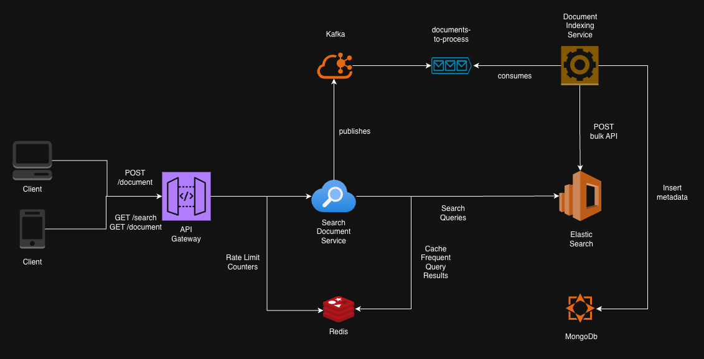

# High Level System Architecture Diagram



The system follows a **Microservices Architecture** with a decoupled ingestion pipeline.

*   **API Gateway**: Handles Rate Limiting (per tenant), Authentication, and Request Routing.
*   **Search Document Service (Node.js/Express)**: Orchestrates the business logic, interacts with the Search Engine, and manages the Cache.
*   **Document Indexing Service**: Consumes from a Kafka to index documents asynchronously to prevent blocking the ingestion API.

**Storage Layer**:
*   **Elasticsearch**: For full-text search and relevance ranking.
*   **Redis**: For caching frequent query results and storing rate-limit counters.
*   **MongoDB**: As the "Source of Truth" for document metadata.

## Multi-Tenancy Strategy
We will use **Logical Isolation**. Every document in Elasticsearch will have a `tenant_id` field. Every query will strictly include a filter: `{"term": {"tenant_id": "current_tenant"}}`. This ensures no cross-tenant data leakage at the application level.

## Data Flow
*   **Ingestion**: Client → API → Message Queue → Worker → Elasticsearch + Database.
*   **Search**: Client → API → Redis (Check Cache) → Elasticsearch (Search) → API → Client.

---

# Architecture Overview: Distributed Search Service

## 1. Database & Storage Strategy
We employ a **Polyglot Persistence** strategy, utilizing specific stores for their strengths:

*   **Elasticsearch (Search Engine)**:
    *   **Role**: Primary search and query engine.
    *   **Choice**: Selected for its inverted index capabilities, relevance scoring, and horizontal scalability.
    *   **Version**: v8.11.0 (aligned with Docker infrastructure).
    *   **Optimization**: Fields like `tenant_id` are mapped as `keyword` for performant exact filtering.

*   **MongoDB (Source of Truth)**:
    *   **Role**: Durable system of record.
    *   **Choice**: Flexible Schema-less storage fits standard JSON document ingestion perfectly.
    *   **Usage**: All ingested documents are securely stored here before/parallel to indexing, allowing for re-indexing (replaying from Mongo) if the search index is corrupted or needs schema changes.

*   **Redis (Cache & Fast Access)**:
    *   **Role**: High-speed ephemeral storage.
    *   **Usage**:
        *   **Authentication**: Stores `API Key -> Tenant ID` mapping for sub-millisecond lookup during every request.
        *   **Rate Limiting**: Stores sliding window counters for the API Gateway.

## 2. API Design
The API is RESTful, designed around resources (`documents`).

| Method | Endpoint | Description | Payload Example | Response |
| :--- | :--- | :--- | :--- | :--- |
| **POST** | `/v1/documents` | Asynchronous Ingestion | `{"content": {"title": "..."}}` | `202 Accepted` `{ "id": "...", "status": "queued" }` |
| **GET** | `/v1/documents/:id` | Fast Retrieval (ID Lookup) | N/A | `200 OK` `{ "id": "...", "content": ... }` |
| **DELETE** | `/v1/documents/:id` | Asynchronous Deletion | N/A | `202 Accepted` `{ "status": "deletion_queued" }` |
| **GET** | `/v1/search` | Full-text Search | Query Param `?q=search+term` | `200 OK` `{ "hits": [...] }` |

## 3. Consistency Model & Trade-offs
**Model: Eventual Consistency**

*   **Write Path**: Client → Gateway → Kafka → Worker → Mongo & Elastic.
*   **Trade-off**:
    *   **Pros**: High Availability and Write Throughput. The API never blocks on database locks or indexing latency.
    *   **Cons**: "Read-your-writes" delay. A document submitted now may appear in search results a few milliseconds/seconds later.

## 4. Caching Strategy
*   **Identity Caching (Implemented)**: API Keys are cached in Redis. This prevents the Gateway from needing to query a slower SQL/User database for every single API call.
*   **Rate Limit Caching (Implemented)**: Request counts are atomically incremented in Redis.
*   *(Future)* **Query Caching**: Redis could catch common search queries (`GET /search?q=common`) to bypass Elastic entirely.

## 5. Message Queue Usage (Kafka)
Kafka acts as the **spinal cord** of the ingestion pipeline.

*   **Topic**: `document-ingestion`
*   **Partitioning Key**: `tenant_id`. This guarantees that all events for a specific tenant are processed in order (sequentially) by the same consumer instance.
*   **Operations**:
    *   `type: 'index'`: Create/Update payload.
    *   `type: 'delete'`: Remove payload.
*   **Benefits**:
    *   **Decoupling**: The API Gateway doesn't care if the Database or Search Worker is slow or down.
    *   **Backpressure**: Spikes in traffic are buffered in the queue, protecting the downstream databases from being overwhelmed.

## 6. Multi-tenancy & Data Isolation
**Strategy: Logical Isolation with Strict Enforcement**

1.  **Ingestion/Write**:
    *   The API Gateway resolves the `X-API-KEY` to a `tenant_id` immediately.
    *   This `tenant_id` is stamped onto the Kafka message and stored in the document body in Mongo/Elastic.

2.  **Search/Read**:
    *   The Search Service **never** trusts the client's query alone.
    *   A **Mandatory Filter** is injected into every Elasticsearch query:
        ```json
        filter: [ { term: { "tenant_id.keyword": "derived-tenant-id" } } ]
        ```
    *   Since this is a `filter` (not a query), it is cached by Elasticsearch and efficiently prunes the search space.
    *   Usage of `routing: tenant_id` ensures that for large clusters, we only query the specific shard holding that tenant's data.

**Working Prototype**: [https://github.com/parv-jain/distributed-search-service](https://github.com/parv-jain/distributed-search-service)

---

# Production Readiness Analysis

## 1. Scalability (100x Growth)
*   **Elasticsearch Sharding**:
    *   **Current**: Default 1 shard.
    *   **Required**: Implement **Index Lifecycle Management (ILM)** to rollover indices by size (e.g., 50GB shards). Use `routing` (already implemented) to query only relevant shards.
    *   **Strategy**: Increase nodes to 3+ for HA. Use hot-warm architecture for older data.
*   **Kafka Partitioning**:
    *   **Current**: 1 partition.
    *   **Required**: Increase partitions (e.g., 32 or 64). Scale **Indexing Worker** instances to match partition count.
*   **Stateless Services**:
    *   Auto-scale API Gateway and Search Service behind a Load Balancer (AWS ALB / Nginx) based on CPU/Memory/Request Count.

## 2. Resilience
*   **Circuit Breakers**:
    *   Implement API Gateway wrapping calls to Redis/Kafka/SearchService. Fail fast if downstream is stressed.
*   **Dead Letter Queues (DLQ)**:
    *   Implement in **Indexing Worker**. If a message fails (malformed JSON, Elastic down), move to DLQ topic (`document-ingestion-dlq`) instead of crashing the consumer or blocking the partition.
*   **Retries**:
    *   Implement exponential backoff for transient failures (network blips) in DB connections.

## 3. Security
*   **Authentication**:
    *   Migrate from Redis Simple Strings to **JWTs (OIDC/OAuth2)** for user identity. Keep API Keys for machine-to-machine but hash them (bcrypt/argon2) in SQL, caching only valid hashes in Redis.
*   **Encryption**:
    *   **Transit**: Enforce TLS (HTTPS) everywhere. Enable TLS for Kafka and Elastic internal communication.
    *   **Rest**: Enable Encryption at Rest in MongoDB (Enterprise/Atlas) and Elasticsearch.
*   **Network**:
    *   Run database/worker nodes in private subnets. Only expose API Gateway via public Load Balancer.

## 4. Observability
*   **Metrics (Prometheus/Grafana)**:
    *   Expose `/metrics` endpoint in Fastify.
    *   Track: Ingestion Lag (Kafka consumer lag), Indexing Latency, Search Latency (p95/p99), HTTP Error Rates.
*   **Distributed Tracing (OpenTelemetry)**:
    *   Trace ID (`request-id`) must propagate: Gateway → Kafka Header → Worker → Elastic.
    *   Visualize waterfall in Jaeger/Datadog to identify bottlenecks.
*   **Logging**:
    *   **Current**: JSON logs (Pino).
    *   **Required**: Centralized aggregation (ELK Stack, CloudWatch, Datadog) to correlate logs by Trace ID.

## 5. Performance
*   **Mapping Control**: Explicitly define index templates. Disable `doc_values` for fields not sorted/aggregated to save disk.
*   **Refresh Interval**: Increase Elastic refresh interval from `1s` to `30s` (or higher) to boost ingestion throughput at the cost of "real-time" search delay.
*   **Bulk Indexing**: Update Indexing Worker to batch Kafka messages (e.g., flush every 500 docs or 1 second) instead of 1-by-1 indexing.

## 6. Operations & SLA (99.95%)
*   **Zero-Downtime Deployment**:
    *   Rolling updates for Stateless services (Kubernetes Deployments).
    *   Blue/Green deployment for breaking API changes.
*   **Disaster Recovery**:
    *   Snapshot MongoDB/Elasticsearch to S3 hourly.
    *   Test "Replay from Source" procedure: Re-index everything from MongoDB using a dedicated batch job.
*   **SLA Strategy**:
    *   Redundant infrastructure (Multi-AZ).
    *   Decoupled Ingestion: If Search is down, Ingestion (Kafka) accepts writes (99.99% availability). Search availability targets 99.95%.
